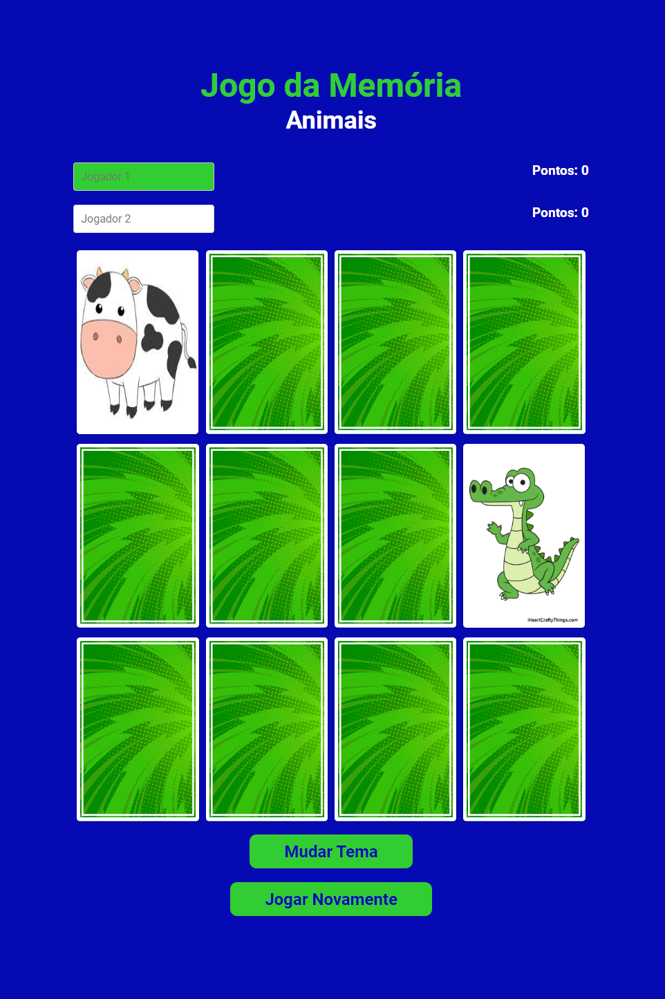

<h1 align="center">JOGO DA MEMÓRIA - Trabalho final da disciplina de DW2 - Desenvolvimento Web II</h1>

LAYOUT:
 
Tabuleiro de cartas com colunas e linhas (ver número de cartas). Uma imagem na parte da frente, uma na parte de trás.

CLASSES:
 
Classe para as cartas: Esta classe deve incluir propriedades para a imagem da frente e da parte de trás, bem como um método para verificar se a carta foi selecionada corretamente.

Classe para o jogo: Uma classe para o jogo em si. Esta classe deve incluir propriedades para o número de cartas, a matriz de cartas e um método para iniciar o jogo.

Classe para o tabuleiro: Uma classe para o tabuleiro do jogo. Esta classe deve incluir um método para embaralhar as cartas e outro para exibir o tabuleiro na tela.

Adicionar herança: Uma classe para as cartas viradas para cima que herda da classe Carta, e uma classe para as cartas viradas para baixo que também herda da classe Carta. Isso permite que você crie instâncias das cartas viradas para cima e para baixo usando a mesma classe pai.

FUNÇÕES:

Adicionar interação: Um evento de clique para as cartas, para que o jogador possa virá-las para encontrar os pares corretos. Quando duas cartas forem selecionadas, verifique se elas correspondem. Se não corresponderem, volte a virá-las de frente para baixo. Se corresponderem, deixe-as viradas para cima.

Adicionar lógica do jogo: Uma função para verificar se o jogo foi concluído com sucesso. 
Se todas as cartas estiverem viradas para cima, o jogo terminou e o jogador ganhou.

NAVEGAÇÃO:

Botões de navegação nas páginas.

FALTA ADICIONAR:

Mensagem de finalização: Uma mensagem parabenizando o jogador

Pontuação: Um sistema de pontuação para o jogo, para que o jogador possa acompanhar seu desempenho.

Desenvolvido por: <a href="https://github.com/mcavalle">Mariana Cavalle</a>, <a href="https://github.com/hebertsanches">Hebert Gomes Sanches</a> e <a href="https://github.com/C4PISTRANO">Raphael Ferreira Capistrano</a>

